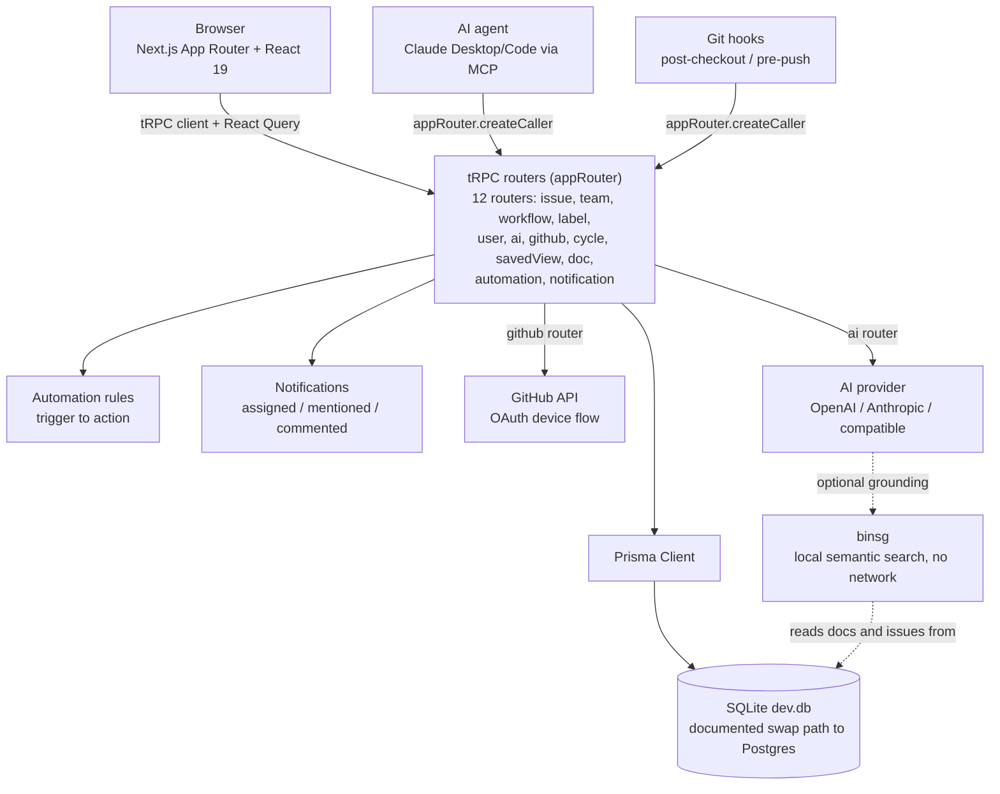

# NovaStructur

A well-rounded, low-bloat project manager that also happens to track issues.
Triage, issues, a kanban board, cycles, a roadmap, and a docs wiki, all in
one local-first app, with git and AI agent integrations that update status
for you instead of asking you to keep it current by hand.

Demo login (seeded data): `lilith@acme.dev` / `password123`

Licensed under [AGPL-3.0-or-later](LICENSE): free to use, modify, and
self-host, but a modified version run as a network service has to offer
its source too, not just a modified version that's distributed.

## Contents

- [Features](#features)
- [Architecture](#architecture)
- [Data model](#data-model)
- [Conflict-safe data (CRDT)](#conflict-safe-data-crdt)
- [Automatic status updates](#automatic-status-updates-no-separate-go-update-the-ticket-step)
- [Tech stack](#tech-stack)
- [Getting started](#getting-started)
- [Scripts](#scripts)
- [Project structure](#project-structure)
- [Design system](#design-system)
- [Where things stand](#where-things-stand)

## Features

**Triage inbox.** New issues (from any source, Slack/email/GitHub/Sentry in
the design mockup) land here first, not straight into a team's backlog, so
nothing gets picked up as real work without a quick accept/decline look.

**Issues list** with filters (team, assignee, priority, label, free-text
search) and saved views, so a filter combination you use often becomes a
one-click bookmark instead of five dropdown clicks every time.

**Kanban board** with drag-and-drop status changes, backed by an optimistic
cache update so a drag feels instant even before the mutation round-trips.

**Cycles** (sprints), with a Backlog tab for unscheduled work, cycle status
(upcoming/active/completed) derived from `startDate`/`endDate` rather than
stored (nothing to forget to flip), and a progress bar by both issue count
and estimate points.

**Roadmap** timeline for epics, plotted from creation date to due date.
Deliberately no dependency graph, just a timeline: simpler to read at a
glance than a Gantt chart nobody keeps current.

**Docs wiki**: nestable markdown pages, linkable to issues from either
direction (a doc lists its linked issues, an issue lists its linked docs),
rendered with a tiny dependency-free markdown parser (`src/lib/markdown.tsx`)
rather than pulling in a full CommonMark library for headings, bold/italic,
code, links, and lists.

**Issue detail**: sub-issues, relations (blocks / relates to / duplicates,
in both directions), comments, linked docs, and GitHub PR links with
auto-sync every 60 seconds while a linked PR is open.

**Notifications**, scoped to three events that are actually actionable
(assigned, mentioned, commented-on) rather than every possible activity, so
it doesn't turn into noise. In-app only for now, no email or Slack fan-out.

**AI draft description**: bring-your-own OpenAI/Anthropic/OpenAI-compatible
API key (encrypted at rest, never returned to the client after saving),
optionally grounded in this project's own docs and issues via
[binsg](../binsg), a local semantic search tool with no network call. Leave
it unconfigured and drafting still works, just without project-specific
grounding.

**Automation rules**: deliberately just "when X happens, do Y", one trigger,
one action, no AND/OR condition builder, per an anti-bloat stance on
elaborate workflows nobody remembers the purpose of a year later.

## Architecture

The single most important architectural decision in this codebase: **every
entry point calls the exact same tRPC routers**, so there is no second,
thinner code path to keep in sync. The web UI, the MCP server (AI agents),
and the git-bridge hooks all run identical validation, identical automation
rules, and the same forward-only status-transition rule the GitHub sync
depends on. Whichever door you come in through, the rest of the system
can't tell the difference.



A few things that fall out of drawing it this way:

- **No separate API to keep in sync.** The MCP server and git-bridge don't
  call an HTTP API, they import `appRouter` directly (`createCaller`) and
  talk to the same SQLite file. Fine for local dev; if NovaStructur ever
  moves to a hosted Postgres setup, both need to switch to calling the
  deployed API over HTTP instead of touching the DB in-process (noted in
  each subsystem's own README).
- **Status only moves forward automatically.** Both the GitHub sync and
  git-bridge only advance an issue's status (OPEN PR to STARTED, MERGED to
  COMPLETED), never move it backward. Moving something back is always a
  manual, human action, on purpose.
- **The Next.js route split enforces auth structurally, not just by
  convention.** `src/app/(app)/*` (issues, board, cycles, roadmap, docs,
  triage, issue detail, settings) sits under a layout that loads the
  session server-side and renders `<AppShell>`, which returns nothing but
  `children` if there's no user. `src/app/login` sits outside that group
  entirely.

## Data model

Defined in `prisma/schema.prisma`. The core shape:

```
Organization
 └─ Team (issue/cycle counters live here, for identifiers like ENG-142)
     ├─ WorkflowState (per-team; type: TRIAGE/BACKLOG/UNSTARTED/STARTED/COMPLETED/CANCELED)
     ├─ Cycle (status derived from dates, not stored)
     └─ Issue
         ├─ labels (IssueLabel, many-to-many with org-level Label)
         ├─ subIssues / parent (self-relation)
         ├─ outgoingRelations / incomingRelations (BLOCKS / RELATES_TO / DUPLICATES)
         ├─ comments
         ├─ githubLinks (IssueGitHubLink, unique per repo+PR number)
         └─ linkedDocs (DocIssueLink)

Doc (nestable via parentId, orphans children on delete rather than cascading)
SavedView (a personal bookmark of filter criteria, not a shared object)
AutomationRule (one trigger, one action)
Notification (assigned / mentioned / comment)
GitHubConnection / PendingDeviceAuth (per-user OAuth device-flow state)
```

Worth knowing if you're touching the schema: `Issue.labelsCrdt` and
`Doc.contentCrdt` are extra columns alongside the normal, queryable
`IssueLabel` rows and `Doc.content` text. They're not redundant, they're
the merge-safe source of truth (see next section); the plain columns are a
fast materialized view kept in sync with them.

## Conflict-safe data (CRDT)

Two fields in this schema are the kind that can genuinely collide under
concurrent edits: an issue's label set (two people toggling labels on the
same issue at once) and a doc's content (two people editing the same page).
For everything else, last-write-wins is fine because there's nothing to
merge, just two different opinions about one value, and losing the loser's
write is an acceptable, rare cost.

Four primitives in `src/lib/crdt` (each just answers "given two concurrent
writes, what does the merged state look like", no persistence or network
sync built in, see `src/lib/crdt/README.md` for the full writeup):

| Primitive | Used for | In this schema |
|---|---|---|
| `LWWRegister` | any single scalar, most-recent-write-wins is correct | `Issue.title`, `.priority`, `.stateId`, `.assigneeId`, `.dueDate`, `.estimate`, `.cycleId`, `.sortOrder`, `Doc.title` |
| `ORSet` | many-valued, add/remove, join-table shaped | issue labels, team memberships, doc-issue links |
| `Fugue` | ordered content, concurrent inserts at the same position shouldn't interleave character-by-character | `Doc.content` (the real case), `Issue.description` (a judgment call, currently left as plain LWW) |
| `Clock` / `OpId` | not a data type, the shared ordering primitive the other three build on | one per active client/session |

`src/server/crdt/issue-labels.ts` and `src/server/crdt/doc-content.ts` are
the Prisma-integration layer on top of those primitives, which is also why
`label-picker.tsx` fires two separate mutations (`addLabel`/`removeLabel`)
instead of sending a whole recomputed array: the ORSet tracks add/remove as
discrete operations, so a click here needs to be one too, not a full array
that can silently clobber a concurrent change to a *different* label.

**Not built yet, on purpose:** persistence of the CRDT state itself beyond
the two schema columns mentioned above, and real-time network transport (the
types are operation-based, so any transport that eventually delivers every
op works, doesn't need to be live). Fugue's placement rule is verified
against the paper's canonical concurrent-typing example plus a seeded fuzz
test; the full formal non-interleaving proof isn't independently
re-verified for every edge case.

`Fugue.compact()` prunes leaf tombstones (a deleted node with no
children) after every save, so a doc doesn't accumulate one tombstone per
deleted character forever. That's a narrower, easier problem than the
general distributed tombstone-GC question ("has every replica seen this
delete yet"), which still isn't built and only matters if NovaStructur
ever grows real offline, multi-replica sync, since today every op is
generated fresh against the current server-side tree in the same
transaction that persists it. Full argument in `src/lib/crdt/README.md`
and `fugue.ts`'s own doc comment on `compact()`.

Run the suite: `npm run test:crdt`

### Automatic status updates (no separate "go update the ticket" step)

- **GitHub**: paste a PR URL onto an issue and it syncs automatically.
  OPEN moves the issue to STARTED, MERGED moves it to COMPLETED
- **git-bridge** (`src/git-bridge`, see its own README): local git hooks.
  Checking out a branch named with an issue key starts that issue.
  Pushing adds a commit summary comment and auto-links an open PR if the
  `gh` CLI is set up
- **MCP server** (`src/mcp`, see its own README): lets an AI agent
  (Claude Desktop, Claude Code, or any MCP client) list, create, and
  update issues, cycles, and docs directly, through the same tRPC routers
  and validation the web UI uses

## Tech stack

Next.js 16 (App Router) with React 19, tRPC 11 + Prisma 7 (SQLite via
`@prisma/adapter-libsql` by default, with a documented path to Postgres),
Auth.js (next-auth v5 beta) for credentials login, Tailwind CSS 4, and
dnd-kit for the board's drag-and-drop.

## Getting started

```bash
npm install
cp .env.example .env
```

Fill in `.env`:

- `DATABASE_URL` already defaults to the local SQLite file, no setup needed
- `AUTH_SECRET`: generate with `openssl rand -base64 32`
- Everything else (`AI_KEY_ENCRYPTION_SECRET`, `BINSG_BIN`/`BINSG_MODEL_DIR`,
  `GITHUB_OAUTH_CLIENT_ID`, `GITHUB_TOKEN_ENCRYPTION_SECRET`,
  `GITHUB_OAUTH_SCOPE`) is optional. See the comments in `.env.example` for
  what each one unlocks and how to generate it.

```bash
npx prisma migrate dev
npx tsx prisma/seed.ts   # optional, adds demo data incl. the login above
npm run dev
```

Open [http://localhost:3000](http://localhost:3000).

Tip: `npx prisma studio` opens a browser GUI on `dev.db` if you want to
poke at the data directly instead of through the app.

## Scripts

| Command | What it does |
|---|---|
| `npm run dev` | Start the dev server |
| `npm run build` / `npm run start` | Production build and start |
| `npm run lint` | ESLint |
| `npm run mcp` | Start the MCP server (see `src/mcp/README.md`) |
| `npm run install-git-hooks` | Install the git-bridge hooks (see `src/git-bridge/README.md`) |
| `npm run heartbeat` | Print a report of this project's stack, dependency pin status, and third-party providers (`--json` for machine-readable output) |
| `npm run test:crdt` | Run the CRDT unit tests |

## Project structure

```
src/
  app/                  Next.js App Router
    (app)/              authenticated route group: issues (page.tsx), board,
                         cycles, roadmap, docs, triage, issue/[identifier],
                         settings, all wrapped in <AppShell>
    login/               credentials login, outside the (app) group
    api/                 route handlers: trpc/, auth/
  components/            React components
    kanban/, cycle/, docs/, issue-detail/, pickers/, ui/
  server/                backend
    api/routers/         the 12 tRPC routers
    crdt/                Prisma-integration layer over lib/crdt
    ai/, github/, rag/   AI provider calls, GitHub API client, binsg bridge
    auth.ts, db.ts, automation.ts, notifications.ts, secret-crypto.ts
  lib/                   client-safe utilities, incl. crdt/ primitives
  trpc/                  client-side tRPC + React Query wiring
  git-bridge/             git hooks (own README)
  mcp/                    MCP server (own README)
  types/                  ambient type augmentation (next-auth.d.ts)
prisma/                  schema, migrations, seed.ts
UI/                       design reference (App.dc), the source for the
                          dark HUD design tokens in globals.css
```

## Design system

The dark "HUD" look (sidebar, login, and every main page) comes from design
tokens in `src/app/globals.css`, pulled from the design reference file in
`UI/`. If you're restyling something that still looks like default Tailwind
neutrals, that file's comment block tracks what's been converted and what
hasn't yet (currently just the settings pages).

## Where things stand

Early days: started August 30, 2026. No production data yet, so the local
SQLite database is safe to experiment on. A calendar page (issues by due
date, cycles by date range) and an opt-in Rust ownership/lifetime mapping
page are planned but not built. Automation rules, saved views,
notifications, and GitHub-link management aren't yet exposed to the MCP
server, only the core issue/cycle/doc loop is.
